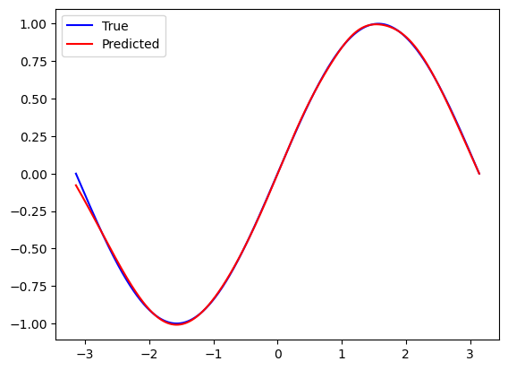

# 实验报告 - pj1H - Part1

## 实验目的

在这个实验中，我们的目标是开发一个名为`qzynn`的自定义深度学习库，该库能够支持基本的神经网络操作，包括激活函数、线性层、损失函数和优化器的前向传播和反向传播。此外，该库还需要支持不同网络结构的灵活组合和调整，以便用于各种机器学习任务，例如分类和回归。

在实现`qzynn`库的过程中，我主要参考了PyTorch的实现方式，借鉴了PyTorch中模块化设计的理念，使得每一个部分如激活函数、线性层、损失函数和优化器都可以作为独立的模块使用。此外，我也参考了其优雅的方式处理前向和反向传播，这对于理解和实现复杂的梯度下降算法尤其重要。

通过模仿PyTorch的API和内部结构，`qzynn`库能够提供用户友好和易于扩展的接口，同时保持了计算效率。例如，激活函数模块中的`ReLU`和`Sigmoid`，以及损失函数模块中的`CrossEntropyLoss`都是参考PyTorch的相关实现来完成的。这种设计不仅帮助了我更深入地理解了这些基本组件的工作机制，也使得`qzynn`库能够在不牺牲性能的情况下，为各种不同的机器学习模型和算法提供支持。

## 模块组成与代码解析
为了缩短文档的长度，代码中省略了注释和一些部分（例如`init`方法），完整内容可见详细代码。
### Modules

#### 激活函数 - `activation.py`

```python
class Sigmoid(Module):

    def forward(self, input):
        self.output = 1 / (1 + np.exp(-input))
        return self.output

    def backward(self, output_grad):
        input_grad = output_grad * ((1 - self.output) * self.output)
        return input_grad
```
**Sigmoid** 
$$ \sigma(x) = \frac{1}{1+e^{-x}}  $$函数通过其特有的指数形状，能够将输入映射到 (0,1) 范围内，常用于二分类问题中。
对 Sigmoid 函数求导可以得到：
$$\sigma'(x) = \sigma(x)(1-\sigma(x))$$

```python
class ReLU(Module):

    def forward(self, input):
        self.output = np.where(input > 0, input, 0)
        return self.output

    def backward(self, output_grad):
        input_grad = np.where(self.input > 0, output_grad, 0)
        return input_grad
```
**ReLU** 
$$ \text{ReLU}(x) = \max(0, x) $$激活函数是非线性函数，允许模型学习复杂数据的决策边界。由于其简单性，ReLU 在计算上非常高效。但是ReLU函数容易出现神经元死亡的问题，需要谨慎地设置超参数。

#### 线性层 - `linear.py`

```python
class Linear(Module):
    def __init__(self, input_dim, output_dim):
        self.weights = np.random.randn(input_dim, output_dim) * 0.01
        self.bias = np.zeros(output_dim)

    def forward(self, input):
        return np.dot(input, self.weights) + self.bias

    def backward(self, output_grad):
        input_grad = np.dot(output_grad, self.weights.T)
        weights_grad = np.dot(self.input.T, output_grad)
        bias_grad = output_grad.mean(axis=0) * input.shape[0]
        return input_grad, weights_grad, bias_grad
```
**Linear** 层是神经网络的基础，用于执行加权和操作，是大多数神经网络架构的核心组成部分。

### 损失函数 - `loss.py`

#### CrossEntropyLoss

```python
class CrossEntropyLoss(Loss):
    def forward(self, input, target):
        self.softmax = np.exp(input) / np.sum(np.exp(input), axis=1, keepdims=True)
        return -np.sum(target * np.log(self.softmax + 1e-15)) / input.shape[0]

    def backward(self):
        input_grad = (self.softmax - self.target) / self.softmax.shape[0]
        return input_grad
```
**CrossEntropyLoss** 是处理多分类问题的常见选择，它测量预测概率分布与目标分布之间的差异。$$ L = -\sum_{c=1}^M y_{o,c} \log(p_{o,c}) $$其中 $ p_{o,c} $ 是模型对于每个类别的预测概率。在交叉熵函数的实现中，我们包含了softmax函数的实现。
交叉熵损失的反向传播非常高效，因为当使用 softmax 函数时，梯度简化为 $ \text{output}_{\text{softmax}} - \text{target} $。


#### MSELoss
```python
class MSELoss(Loss):
    def forward(self, input, target):
        self.input = input
        self.target = target
        loss = np.mean(np.square(input - target))
        return loss

    def backward(self):
        input_grad = 2 * (self.input - self.target) / len(self.target)
        self.model.backward(input_grad)
```
**MSELoss**（均方差损失）是回归任务中最常用的损失函数，计算目标值和预测值之间差的平方的平均值。它的梯度是与误差成正比，表示预测值偏离实际值的程度。
$$ L = \frac{1}{n} \sum_{i=1}^n (y_i - \hat{y}_i)^2 $$

### 优化器 - `sgd.py`

#### SGD (Stochastic Gradient Descent)

```python
class SGD(Optimizer):
    def __init__(self, params, lr=0.01):
        self.params = params
        self.lr = lr

    def step(self):
        for param in self.params:
            param -= self.lr * param.grad
```
**SGD** 是最基本的优化器，通过在每次迭代中调整参数以最小化损失函数，帮助模型学习。在本次的实验中我们没有实现批次读取数据，因此每一次梯度下降都是在所有的数据中随机梯度下降，这可能会导致训练比较不稳定。
$$ \theta = \theta - \eta \cdot \nabla_\theta J(\theta) $$其中 $ \theta $ 表示模型参数，$ \eta $ 是学习率，$ J(\theta) $ 是损失函数。

通过实现`qzynn`库，我们能够深入理解神经网络的基础组件是如何协同工作的。这不仅增强了对算法的理解，也为未来可能的扩展打下了基础。在原本的计划中我还希望实现数据增强、数据批处理、dropout、Adam优化器等功能，但由于时间和难度的原因没有能够完成，希望在将来有机会进一步完善这个库。

---

## 拟合正弦函数实验

### 网络结构和设置

在实验中，我们构建了一个前馈神经网络（FNN），用于拟合正弦函数：$$y=sin(x), x\in[-\pi, \pi]$$网络包括一个输入层、几个隐藏层和一个输出层。查阅资料得知`Tanh`函数最适合这个拟合任务，因为它能输出-1到1之间连续的值，与正弦函数的形式匹配。

### 网络定义：
- **输入层**: 接收单一特征的输入。
- **隐藏层**: 网络包括两个隐藏层，每层20个神经元。
- **输出层**: 输出层是一个神经元，输出一个值，用于回归任务。

### 数据生成

为了训练网络，我们生成了一组数据，其中输入是从$-\pi$到$\pi$的均匀分布，输出是相应的正弦值。这提供了一个典型的回归任务，网络需要学习到输入和输出之间的非线性关系。

### 训练过程

使用均方误差（MSE）作为损失函数，这是回归任务中常用的损失函数，因为它能够衡量预测值与实际值之间的误差平方的平均值。为了优化网络，选择了随机梯度下降（SGD）作为优化器。

#### 训练参数：
- **批次大小**`batch_size`: 使用整个数据集作为一个批次（批次大小等于样本总数）。
- **学习率**`learning_rate`: 初始设定为0.01，采用学习率衰减策略，每100个周期减少10%，以避免在训练后期过度摆动。
- **周期数**`epochs`: 总共2000个训练周期。

### 学习率衰减

实验中还引入了学习率衰减机制`lr_decay`，每100个训练周期，学习率减少到之前的99%。主要是防止模型在一个点陷入循环。
实际上我在这个看似简单的实验**花了非常长的时间**才得到比较满意的结果，主要的原因是开始的设置过于保守，例如将学习率设置为0.001甚至更小，以及设置比较大的衰减率。经过不断尝试发现这些在图像训练上比较常用的参数并不利于正弦函数的拟合，主要是这个任务中并不存在所谓过拟合的情况，因此只要尽可能减少损失即可。另外在本个实验中并没有做出测试集和验证集的区分，由于采样的点足够多，基本可以认为就是对于原函数的拟合，可以预见到是否区分数据集对结果影响不大。

**最终的平均误差**：0.00689
从图中可以见到，拟合函数的最左侧部分仍然不是很完美。实际上，在本次实验中我尝试了sigmoid, relu, tanh三种不同的激活函数，以及不同的数据采样数和学习率，无一例外出现了**两侧比较难拟合的情况**。
猜测这主要有两方面的原因
+ 激活函数往往在两端的性质比较特殊,而本次实验的模型仅最后一层输出没有经过激活函数，因此两侧的性质仍然是比较特殊的。
+ 两端的数据点较少，在随机梯度下降时，可能对两端的拟合较弱。
## 手写汉字分类实验

### 实验目的和设置

这部分实验目的是使用一个前馈神经网络（FNN）来分类手写汉字。网络结构包括多个隐藏层，用于学习从图像像素到汉字类别的映射。我们使用了交叉熵损失（CrossEntropyLoss），这是分类问题中常用的损失函数。

### 数据处理

实验中使用的数据集包含了手写汉字的图像，每个图像被处理为784个特征的一维数组（基于28x28像素的图像）。数据集被分为训练集和测试集，用于训练模型和评估其性能。

### 网络结构

网络配置如下：
- **输入层**: 784个神经元，对应于每个图像的像素值。
- **隐藏层**: 三个隐藏层，分别有256、128和64个神经元。
- **输出层**: 12个神经元，每个对应于一个汉字类别。

ReLU激活函数被用于每个隐藏层，因为它能够提供非线性映射同时避免梯度消失问题。

### 训练过程

网络使用随机梯度下降（SGD）作为优化器。学习率初始化为0.005，并在训练过程中通过学习率衰减策略进行调整，以提高训练的稳定性和效果。具体的学习率衰减设置为每10个周期减少到之前的90%。

训练过程中，每10个周期记录一次模型的损失和验证准确率，并保存当前的模型参数。这有助于监控训练进度并回溯最优模型。

### 实验记录

在实验中，我也尝试了不同的训练策略。首先我对比了隐藏层神经元个数[256, 128, 64]和[512, 256, 128]两种网络的效果，发现二者没有明显差异，所以选择了训练压力更小的前者。

然后我对比了是否对像素进行归一化处理`img_array = np.asarray(img).reshape(-1) / 255.0`的区别，发现归一化后可以得到更好的效果。

接着我对比了是否使用学习率衰减的区别，发现加入学习率衰减可以帮助模型更好地收敛在最优解附近，再经过一些测试，我选择把初始学习率设为0.002，每10个eopch衰减为原来的0.9。训练了150个epoch后，我发现在后期validation accuracy已经不变甚至有所下降，说明已经出现了过拟合的现象，经过对比我选择第80个eooch保存的checkpoint作为结果，**正确率达到92.2%，此时在训练集上的正确率已经达到了99.9%**。随后我尝试在数据集中手工删除了一些有明显问题的字（如：错别字、繁体字），**validation accuracy达到96.1%。**

### 代码实现
#### 模型定义

```python
class FNN_Classifier:
    def __init__(self, input_dim, hidden_sizes, output_dim):
        self.layers = []
        # 输入层到第一个隐藏层
        self.layers.append(Linear(input_dim, hidden_sizes[0]))
        self.layers.append(ReLU())      
        # 隐藏层
        for i in range(1, len(hidden_sizes)):
            self.layers.append(Linear(hidden_sizes[i-1], hidden_sizes[i]))
            self.layers.append(ReLU()) 
        # 最后一层到输出层
        self.layers.append(Linear(hidden_sizes[-1], output_dim))
    
    def forward(self, x):
        for layer in self.layers:
            x = layer.forward(x)
        return x
    
    def backward(self, grad):
        for layer in reversed(self.layers):
            grad = layer.backward(grad)
        return grad
```
#### 训练和测试
```python
def train(model, X, Y, X_val, Y_val, epochs, optimizer, loss_fn, lr_decay=None):
    for epoch in range(epochs):
        total_loss = 0
        for x, y_true in zip(X, Y):
            y_pred = model.forward(x)
            loss = loss_fn.forward(y_pred, y_true)
            total_loss += loss
            loss_fn.backward()
            optimizer.step()

        if lr_decay and epoch % lr_decay['interval'] == 0:
            new_lr = optimizer.lr * lr_decay['factor']
            optimizer.update_learning_rate(new_lr)

        if epoch % 10 == 0:
            print(f"Epoch {epoch}, Loss: {total_loss / len(X)}, LR: {optimizer.lr}")
            val_accuracy = test(model, X_val, Y_val)
            print(f"Validation Accuracy: {val_accuracy}")
            save_model(model, epoch)  # Save model every 10 epochs

def test(model, X, Y):
    correct = 0
    total = len(X)
    for x, y_true in zip(X, Y):
        y_pred = model.forward(x)
        if np.argmax(y_pred) == y_true:
            correct += 1
    accuracy = correct / total
    return accuracy
```
#### 其他设置
```python
model = FNN_Classifier(input_dim=784, hidden_sizes=[256,128, 64], output_dim=12)
optimizer = SGD(model, lr=0.005)
loss_fn = CrossEntropyLoss(model, label_num=12)
lr_decay = {
    'factor': 0.9,  
    'interval': 10  
}
```
### 结论

该手写汉字分类实验展示了前馈神经网络在处理复杂图像分类任务中的有效性。通过适当的网络结构和训练策略，模型能够达到较高的分类准确率，证明了其在实际应用中的潜力。

## 反向传播
在神经网络中，反向传播算法是一种高效的方式，用于计算网络中每个参数的损失函数梯度。这些梯度是优化算法（如随机梯度下降）用来更新网络权重以减少误差的关键。理解反向传播的核心在于理解链式法则，这是微积分中的一个基本规则，用于计算复合函数的导数。

假设我们有一个简单的两层神经网络，用于分类任务，该网络的输出通过一个损失函数与目标值比较以计算误差。设$ f(x) $是网络的输出函数，$ L $是损失函数，则总损失可以表示为$ L(f(x)) $。

为了优化网络，我们需要计算损失函数关于每个权重的梯度，即$\frac{\partial L}{\partial w}$。通过应用链式法则，这可以表示为：

$$
\frac{\partial L}{\partial w} = \frac{\partial L}{\partial f} \cdot \frac{\partial f}{\partial w}
$$

其中，$\frac{\partial L}{\partial f}$是损失函数关于网络输出的梯度，而$\frac{\partial f}{\partial w}$是网络输出关于权重的梯度。

### 链式法则的应用

在一个多层网络中，每层的输出成为下一层的输入。考虑一个具有多个线性和非线性层的网络，如ReLU激活函数。反向传播的任务是从输出层向输入层逐层传递误差信息，计算每个参数的梯度。

设$ z^{(l)} $是第$ l $层的线性变换输出，$ a^{(l)} $是应用激活函数后的输出，则有：

$$
z^{(l)} = w^{(l)} a^{(l-1)} + b^{(l)}
$$
$$
a^{(l)} = \sigma(z^{(l)})
$$

在这里，$ \sigma $是激活函数，比如ReLU。通过逐层应用链式法则，我们可以从输出层反向计算每个参数的梯度：

$$
\frac{\partial L}{\partial w^{(l)}} = \frac{\partial L}{\partial a^{(l)}} \cdot \frac{\partial a^{(l)}}{\partial z^{(l)}} \cdot \frac{\partial z^{(l)}}{\partial w^{(l)}}
$$

### 反向传播的实际应用

在实验中，比如手写汉字分类，网络包含多个线性层和ReLU激活层。反向传播在实际操作中遵循以下步骤：

1. **前向传播**：计算每一层的输出，直至损失函数。
2. **初始化梯度**：设定输出层损失函数的梯度$\frac{\partial L}{\partial a^{(L)}}$。
3. **逆向遍历**：对于每一层$ l $从$ L $到1，使用链式法则计算$ \frac{\partial L}{\partial w^{(l)}} $和$ \frac{\partial L}{\partial b^{(l)}} $。

反向传播算法的美妙之处在于其高效性和对复杂网络结构的普适性。通过自动化工具（如计算图和自动微分），现代框架（如PyTorch或TensorFlow）能够无缝地应用反向传播，即使是在极其复杂的网络结构中也能高效地进行。这使得研究者和工程师可以集中精力设计更好的网络架构和实验，而无需手动计算复杂的梯度。
